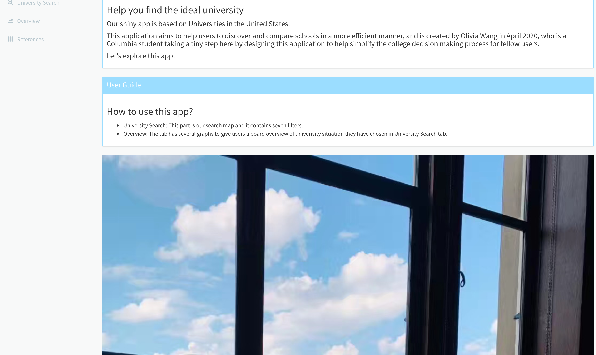
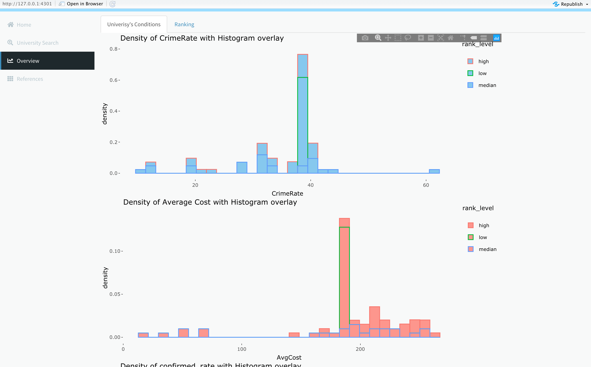
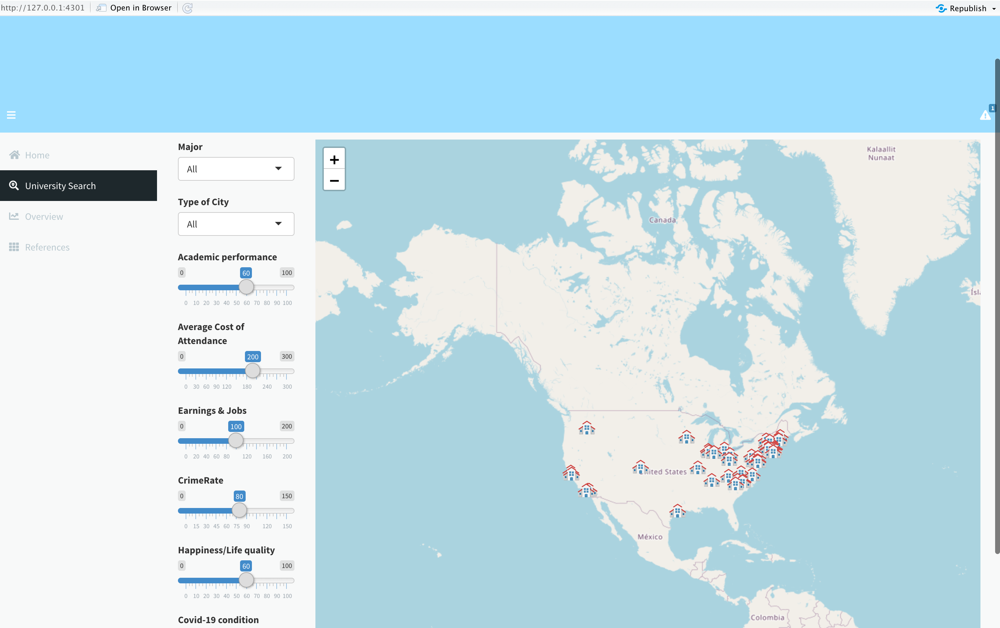

# school_search-

Our shiny app is based on Universities in the United States.

This application aims to help users to discover and compare schools in a more efficient manner,
and is created by Olivia Wang in April 2020, 
who is a Columbia student taking a tiny step here by designing this application to help simplify the college decision making process for fellow users.
